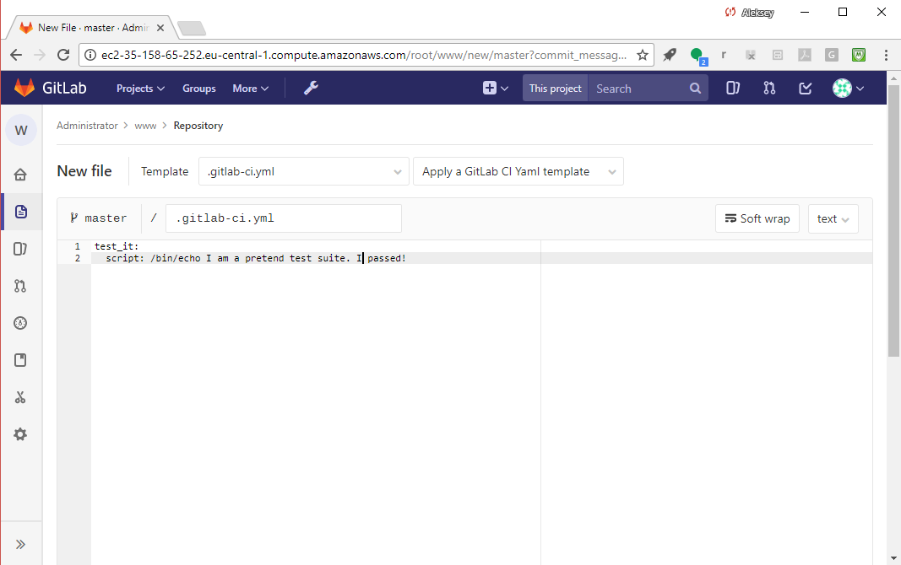
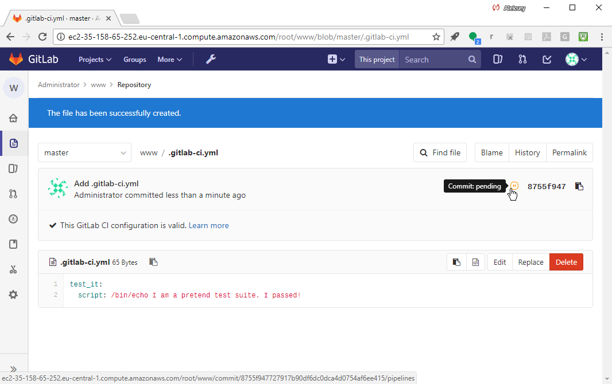
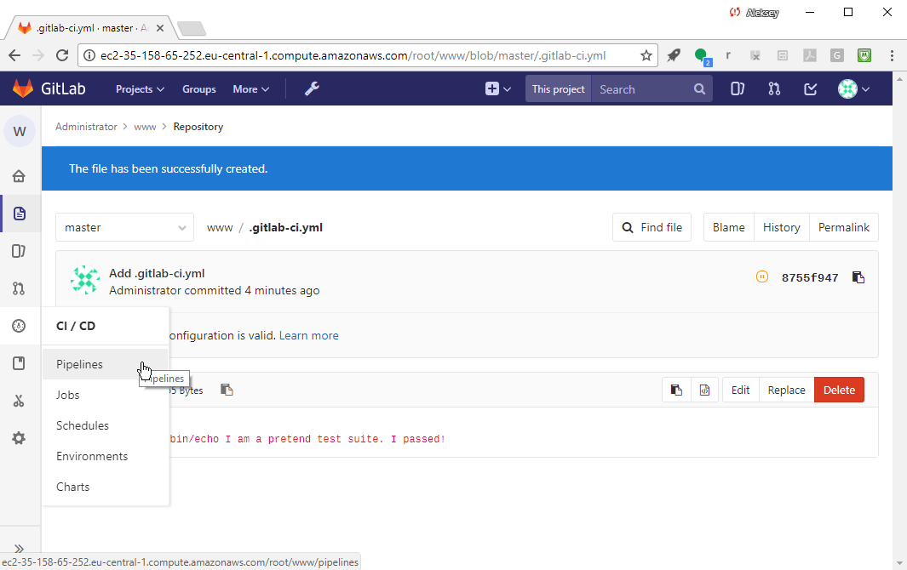

# Set up CI

Notice the "Set up CI" button:


Select "Set up CI" to add the CI config file, `.gitlab-ci.yml`.

The config file format is detailed in  
[Configuration of your builds with .gitlab-ci.yml - GitLab Documentation](https://docs.gitlab.com/ce/ci/yaml/README.html)

This is _the_ reference for GitLab CI configuration syntax!

Let's start with a stub test job:


```
test_it:
  script: /bin/echo I am a pretend test suite. I passed!
```


Select "Commit changes" at the bottom, green.

Our first CI test job, "test_it" will run on every single commit 
to test the new revision. It will execute the /bin/echo command.

Notice that GitLab automatically checks the syntax of the CI config file
and will alert you if the config does not pass validation.

You may notice the "pending" indicator - that's because we haven't
set up a Runner Server yet to run the job:




Go to "CI/CD -> Pipelines" to see our pipeline status:



Here is the status:


The pipeline is stuck in Pending, because we haven't setup our CI/CD
server yet. We'll do that next.

# [[Next]](01_15-installing-docker.md) [[Up]](README.md)
