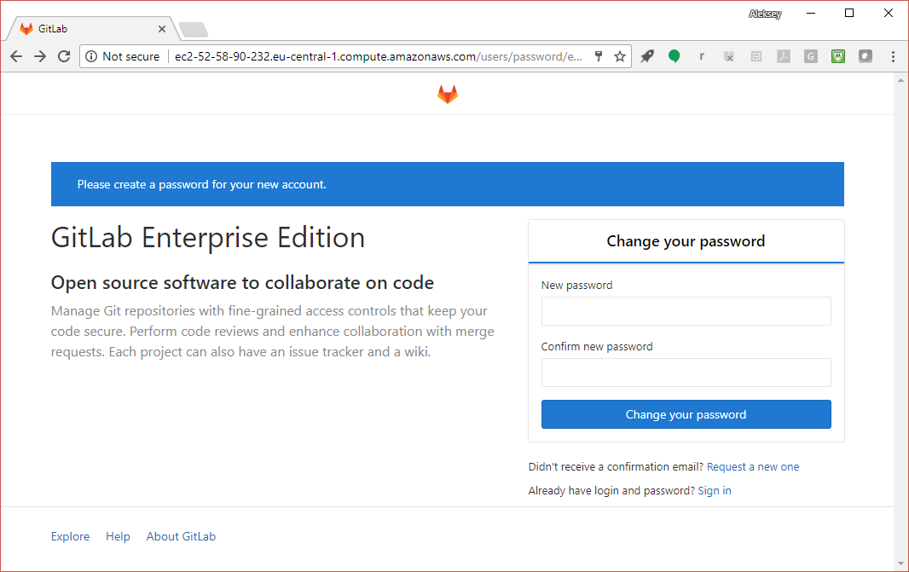

## Setting up your CI/CD infrastructure

### Installing GitLab Server

#### Creating a host

During the LISA tutorial, you'll be provided a Strigo VM (running Ubuntu
16 LTS). Your Strigo VMs will be destroyed at the end of the day.

To continue afterwards, you can use a host in a public cloud (e.g.,
Joyent or AWS). The Joyent instance parameters I use are:

- Hardware Virtual Machine (to run Docker)
- Ubuntu 16 LTS (ubuntu-certified-16.04)
- High CPU with 8 GB of RAM (4 GB for GitLab Server, and 4 GB for GitLab Runner)

---
## Setting up your CI/CD infrastructure

### Installing GitLab Server

#### Strigo VM

URL:  ...
 
Code:  ...
---
## Setting up your CI/CD infrastructure

### Installing GitLab Server

#### Strigo Web terminal: Copying and Pasting

On the Mac, you can use the usual hotkeys (Command-C to copy and Command-V to paste).

On other systems:
- Copying: highlight the text, right-click in the Web browser and select "Copy" from the menu.
- Pasting: use Ctrl-Shift-V.

---
## Setting up your CI/CD infrastructure

### Installing GitLab Server

#### Community Edition vs Enterprise Edition

We'll install GitLab EE (Enterprise Edition) which is functionally
identical to GitLab CE (Community Edition) until you install an
EE license to enable the additional features. This makes upgrading
to EE a breeze.

We'll use the official package from GitLab.  GitLab releases a
new version on the 22nd of every month, no fail (always with
new features).
---
## Setting up your CI/CD infrastructure

### Installing GitLab Server

#### Add the GitLab package repository, and install the package:

```console
curl https://packages.gitlab.com/install/repositories/gitlab/gitlab-ee/script.deb.sh | sudo bash
sudo apt-get install gitlab-ee 
```

Pro tip: Use "x" in your Web browser to select the code block above.

Note: The above is just enough to
get GitLab up for our tutorial. The full installation instructions are at
https://about.gitlab.com/installation/ -- you can look at them after class
if you need extras like outgoing email or HTTPS.
---
## Setting up your CI/CD infrastructure
### Installing GitLab Server
#### Note your GitLab URL

The installer will print the URL of your GitLab Server instance below the
GitLab tanuki (also known as Asiatic racoon, or racoon dog).
Please make a note of the URL. (see next slide)

---
## Setting up your CI/CD infrastructure
### Installing GitLab Server
#### Note your GitLab URL

```text
       *.                  *.
      ***                 ***
     *****               *****
    .******             *******
    ********            ********
   ,,,,,,,,,***********,,,,,,,,,
  ,,,,,,,,,,,*********,,,,,,,,,,,
  .,,,,,,,,,,,*******,,,,,,,,,,,,
      ,,,,,,,,,*****,,,,,,,,,.
         ,,,,,,,****,,,,,,
            .,,,***,,,,
                ,*,.


     _______ __  __          __
    / ____(_) /_/ /   ____ _/ /_
   / / __/ / __/ /   / __ \`/ __ \
  / /_/ / / /_/ /___/ /_/ / /_/ /
  \____/_/\__/_____/\__,_/_.___/


Thank you for installing GitLab!
GitLab should be available at http://ec2-52-59-79-192.eu-central-1.compute.amazonaws.com
```

---
## Setting up your CI/CD infrastructure
### Installing GitLab Server
#### Note your GitLab URL

  
Note your GitLab URL, you *will* need it later.

---
## Setting up your CI/CD infrastructure
### Installing GitLab Server
#### Setting password for "root"

Go to your GitLab Server using the URL you noted in the previous step and set the password for `root`, the initial user on the system.

You should see something like:


