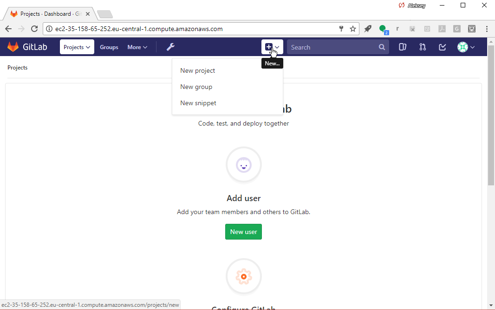
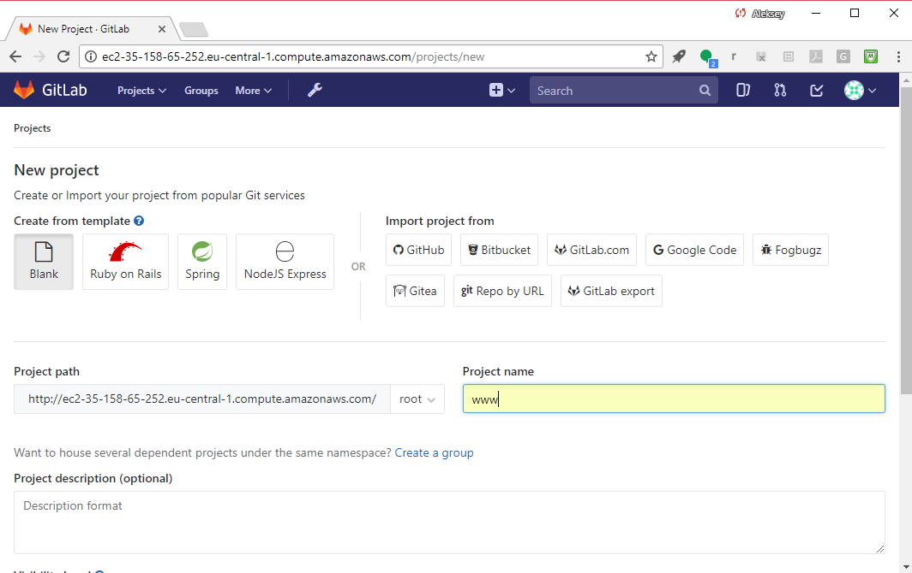
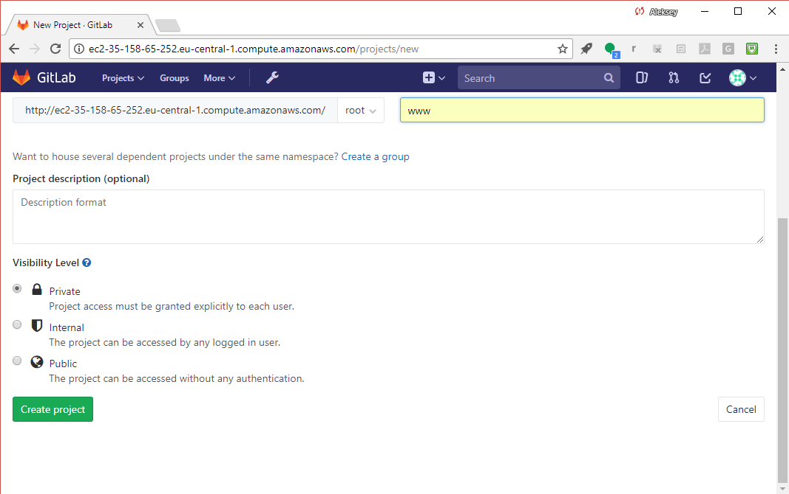
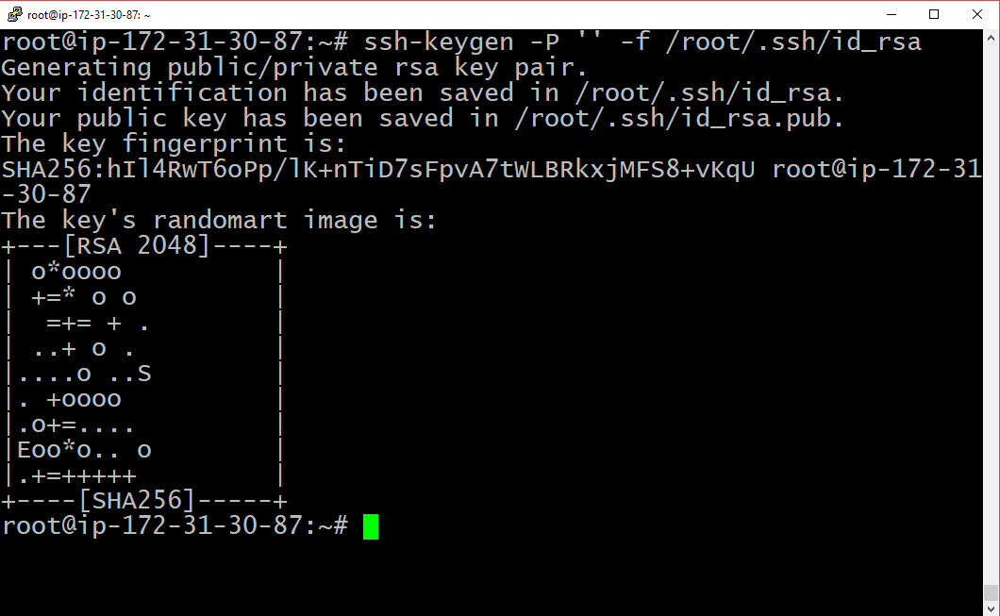
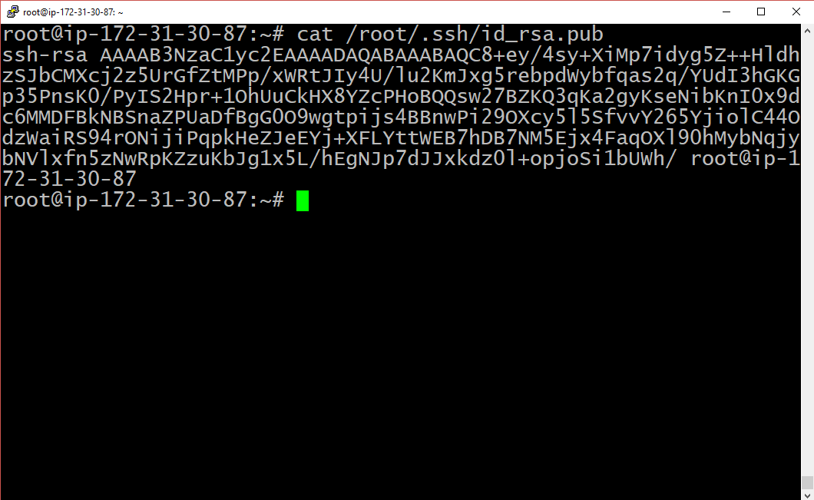
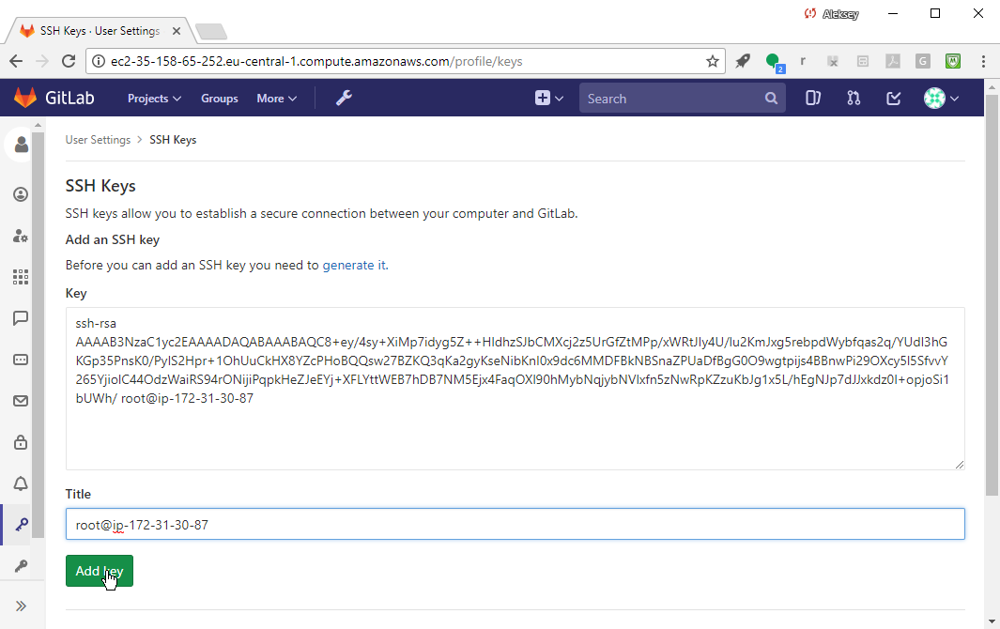
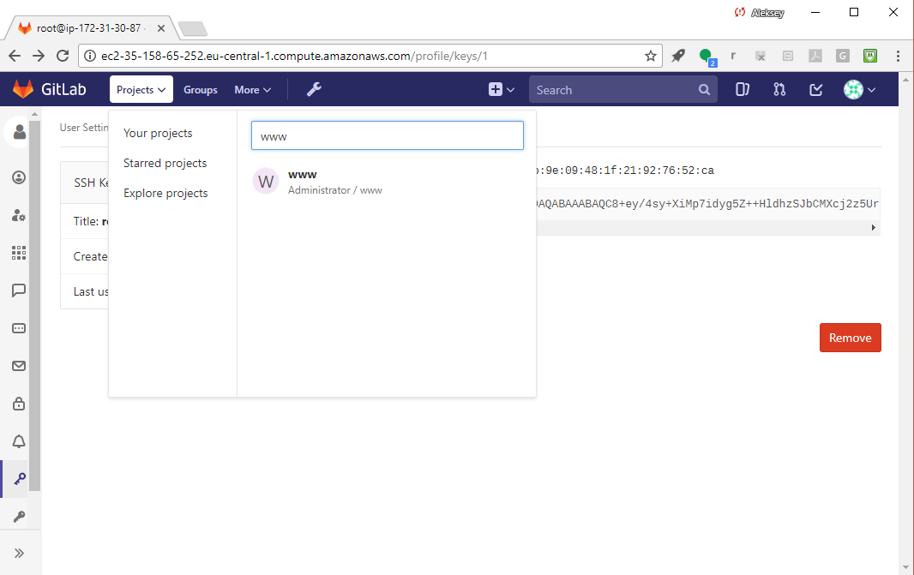
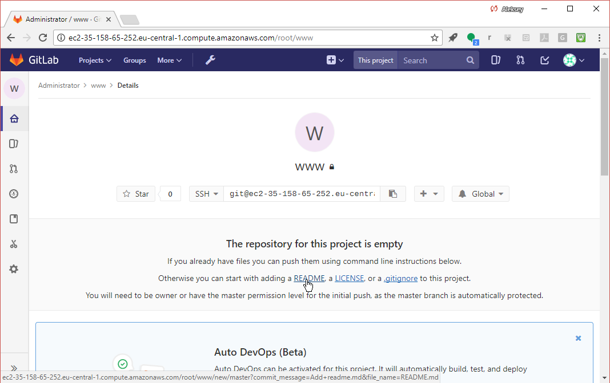
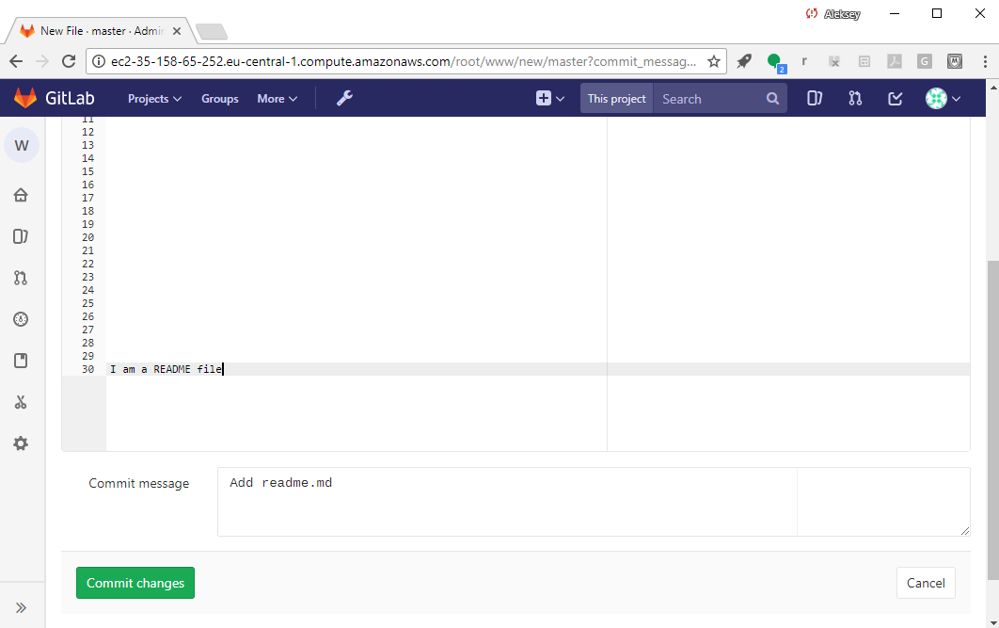
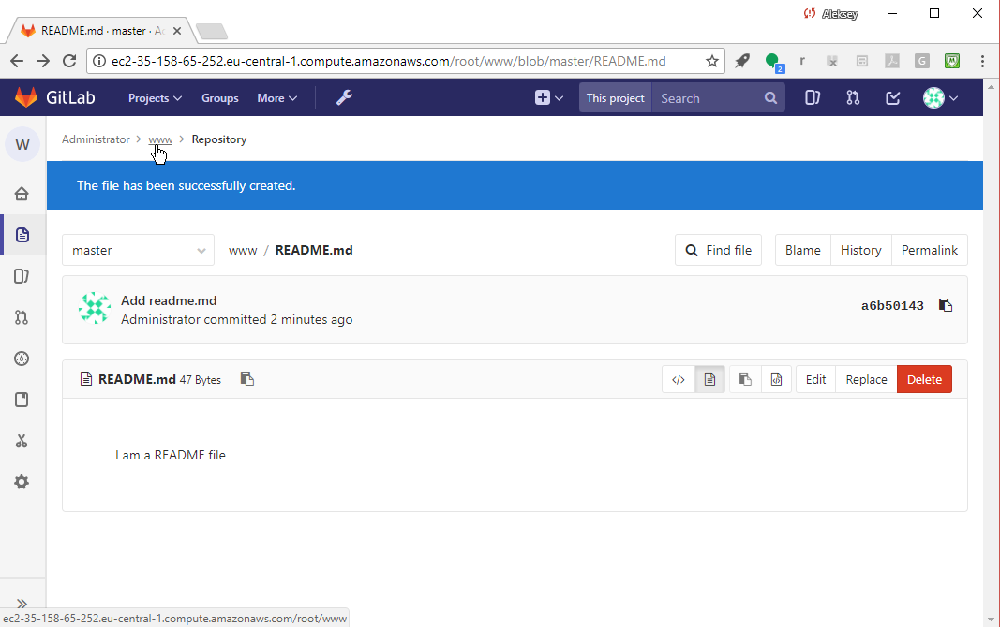

## Setting up your CI/CD infrastructure
### Adding a project

Login as `root`. Add a project. You will use this project to explore GitLab CI functionality.  To add a project, select the "New..." icon (it looks like a plus sign) and select "New project":

---

## Setting up your CI/CD infrastructure
### Adding a project

Name the project "www" (we'll pretend it's the source code
for our web site).

---
## Setting up your CI/CD infrastructure
### Adding a project
Select the big fat green "Create project" button to create your project.

---
## Setting up your CI/CD infrastructure
### Adding a project

GitLab will now take you to the "www" project page, and you should see
a prompt to add an SSH key to your profile so you can pull or push
project code.

Select "Don't show again", as in this tutorial,
you'll use the GitLab Web UI to change files in your project.

---
<!--
## Add an SSH key

Select "add an SSH key", and then, in your shell session,
create an SSH key:

Whoomp! There it is:

Add your public key to GitLab:

Go back to your "www" project:

-->

## Setting up your CI/CD infrastructure
### Adding a project

Add a README.md file by selecting "README" in the UI:

---

## Setting up your CI/CD infrastructure
### Adding a project

Put in some text (e.g., "I am a README file") and select "Commit changes"
to create the file.

---

## Setting up your CI/CD infrastructure
### Adding a project

You should then see the confirmation.

---

## Setting up your CI/CD infrastructure
### Adding a project
Use the navigation breadcrumbs at the top to go back to the main "www" project screen:

