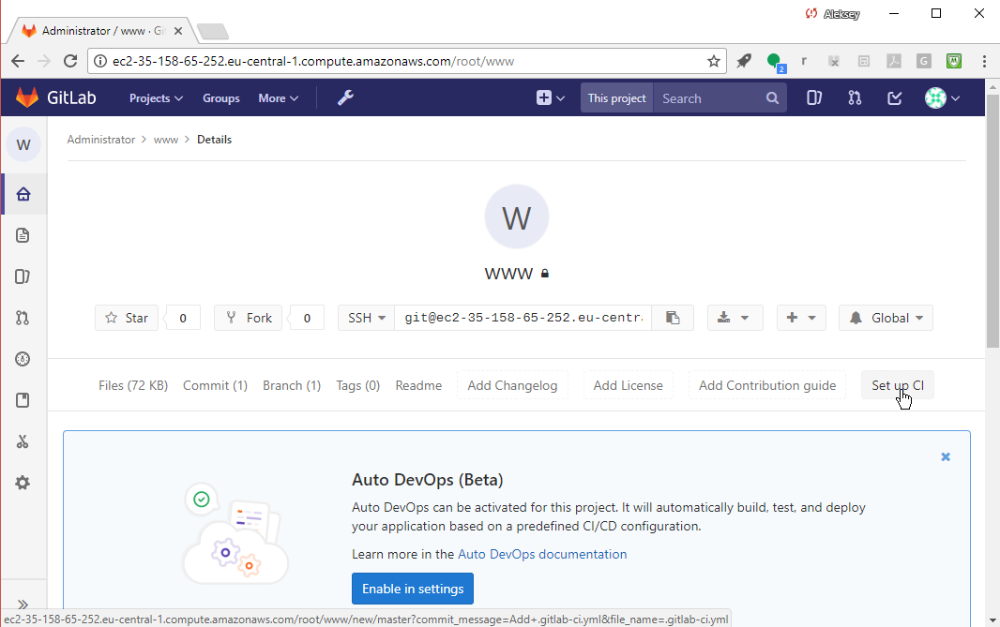
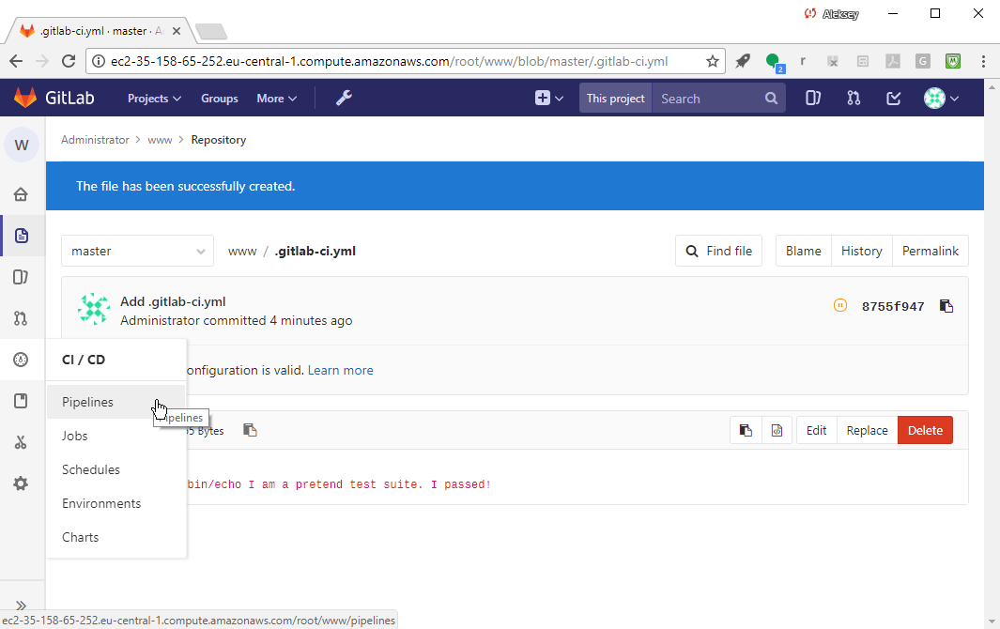
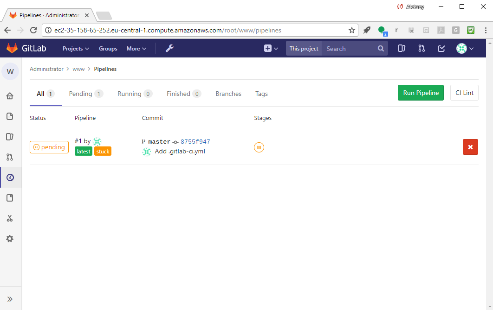

## Setting up your CI/CD infrastructure
### Configuring CI

Now that we have a file in our project, GitLab UI offers a "Set up CI" button:



---

## Setting up your CI/CD infrastructure
### Configuring CI

Select "Set up CI" to create the GitLab CI config file, `.gitlab-ci.yml` in the Web editor.

The GitLab CI configuration syntax is detailed
[here](https://docs.gitlab.com/ce/ci/yaml/README.html).

In addition to the Gitlab CI syntax, since the file is in YAML,
it has to follow the rules for [YAML](http://yaml.org).

There can be one `.gitlab-ci.yml` file per project and it lives at the top level.
---
## Setting up your CI/CD infrastructure
### Configuring CI

Edit your `.gitlab-ci.yml` to add a test job:


```console
test_it:
  script: /bin/echo I am a pretend test suite. I passed!
```
Reminder: If you're viewing this on gitpitch.com, "x" highlights the code block.
Select "Commit changes" at the bottom, green.

(See next slide.)

---
## Setting up your CI/CD infrastructure
### Configuring CI
Using the built-in Web editor:


---

## Setting up your CI/CD infrastructure
### Configuring CI

`script` lists the command the GitLab test runner will run to test your code.

Or, it could be a list of commands:

```console
my_CI_job:
  script:
  - make
  - make test
```


---


## Setting up your CI/CD infrastructure
### Configuring CI

Our first CI job, "test_it" will run on every commit 
to test the new revision. It will run the test command
we specified.

On the next slide, notice:
- that GitLab checks the syntax of the CI config file
- the orange pause icon ("pending" indicator) - we haven't
set up our Runner Server yet so there are no runners available.

---?image=img/pending_pipeline.png

---
## Setting up your CI/CD infrastructure
### Configuring CI
Go to "CI/CD -> Pipelines" to see pipeline status:



---
## Setting up your CI/CD infrastructure
### Configuring CI
You'll see the pipeline is "pending":



Let's setup our CI/CD server yet.
