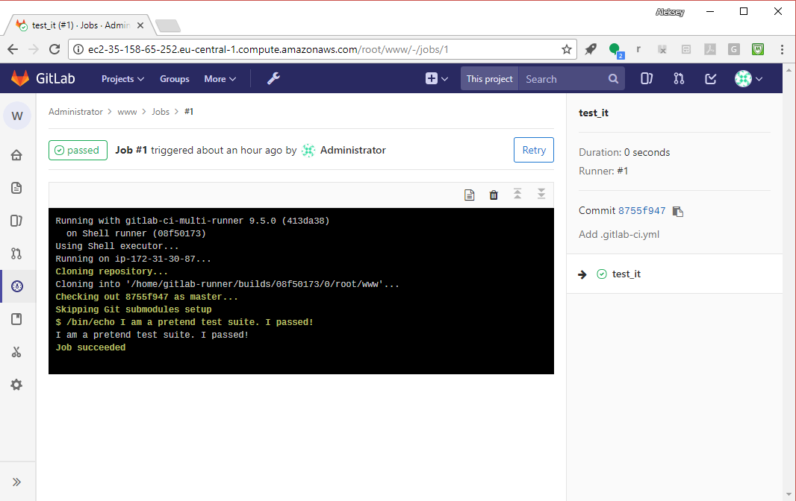

## Setting up your CI/CD infrastructure

### Registering runners

#### Introduction

In this section, you will register different types of runners.

---

## Setting up your CI/CD infrastructure
### Registering runners

First, we need to get, from the GitLab UI, the API URL and the runner registration token.

Go to "Settings" (gear icon in the vertical nav bar on the left), and select "CI/CD":


---

## Setting up your CI/CD infrastructure
### Registering runners

Find and select "Runner settings" in the menu:


---
## Setting up your CI/CD infrastructure
### Registering runners


There'll be no runners listed (we haven't set up any yet), 
but notice the instructions (in the left pane) for registering
runners with the GitLab API endpoint:


---

## Setting up your CI/CD infrastructure
### Registering runners


To register a runner, run:

```bash
sudo gitlab-ci-multi-runner register
```
You'll be prompted for:
- The GitLab Server API endpoint URL (to pick up jobs, return outcomes and upload build artifacts). You can get it from GitLab's runner settings.
- Registration token. You can get it from GitLab's runner settings, too.
- For description, put "Shell runner" (the first runner will be a shell runner)
- Don't put any tags (you can tag runners, and then list tags in jobs to route jobs to specific runners)
- Don't lock the runner to a project (not locking the runner makes it a shared runner, so it can be shared between projects)
- For executor, pick "shell". The executor type tells the Runner Server in what kind of environment to execute the job (e.g., shell, SSH, Vagrant, Docker, Kubernetes).

---
## Setting up your CI/CD infrastructure
### Registering runners
Confirm the runner was created:

```bash
sudo gitlab-runner list
```

Example:

```shell_session
ubuntu@ip-172-31-24-94:~$ sudo gitlab-runner list
Listing configured runners    ConfigFile=/etc/gitlab-runner/config.toml
Shell runner                  Executor=shell Token=296362d1338ca9b3c2862a4f7570c2 URL=http://ec2-52-58-90-232.eu-central-1.compute.amazonaws.com/
ubuntu@ip-172-31-24-94:~$

```
---

## Setting up your CI/CD infrastructure
### Registering runners
You can also register runners non-interactively:

```console
sudo gitlab-runner register --non-interactive \
                            --url <url> \
                            --registration-token <token> \
                            --executor shell \
                            --description "Shell Runner"
```

---

## Setting up your CI/CD infrastructure
### Registering runners
Refresh the "CI/CD settings" page and expand "Runner settings" again.
You should see your Shell runner. (See next slide.)

---?image=img/shell_runner_in_UI.png


---

## Setting up your CI/CD infrastructure
### Registering runners
Notice the green "ready" light. The runner is available (online and checking in for jobs):


---

## Setting up your CI/CD infrastructure
### Registering runners
Select the runner id to see runner detail. 

---
## Setting up your CI/CD infrastructure
### Registering runners
Go back and select the "edit" icon, next to the id, to see how you can change the runner's configuration.

---

## Setting up your CI/CD infrastructure
### Checking pipeline status

Select "CI/CD" -> "Pipelines" in the menu:


---

## Setting up your CI/CD infrastructure
### Checking pipeline status

Remember the job that was pending because no runner was available?
It should now say "Passed":


---

## Setting up your CI/CD infrastructure
### Checking pipeline status
Select the "Passed" icon to see pipeline detail:


---

## Setting up your CI/CD infrastructure
### Checking pipeline status
Now we see the stages of the pipeline (this pipeline has one stage, Test) and the jobs in each stage:


---

## Setting up your CI/CD infrastructure
### Checking pipeline status
Select the "test_it" job icon to see the detail for that run of the job:


---

## Setting up your CI/CD infrastructure
### Checking pipeline status

The job detail includes the console log:



Notice that the runner checked out the code from Git and then (pretend) tested it.


---

## Setting up your CI/CD infrastructure
### Locking down the Shell runner

We are going to set up two runners:
- Shell runner (with "shell" tag) will pick up jobs to run on the Runner Server host directly. We are going to establish an SSH trust relationship from Runner Server host to UAT and Prod environments, and we'll deploy code from Runner Server to the environments.

- Docker runner (with "docker" tag) will pick up test jobs which should be run in ephemeral environments (to ensure reproducibility). 


---
## Setting up your CI/CD infrastructure
### Locking down the Shell runner
Change the Shell runner so it only picks up jobs tagged "shell":
- Go to "Settings -> CI/CD -> Runner settings" 
- Select the edit icon next to the Shell runner id
- Uncheck "Run untagged jobs"
- Add "shell" to tags.  
- Select green "Save changes" button.

(See next slide.)

---?image=img/edit-runner-to-add-tag.png

