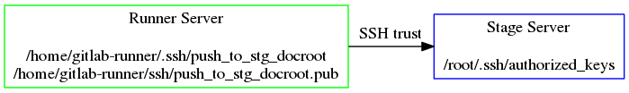

## Setting up your CI/CD infrastructure
### Set up trust
#### Deploy to Stage via SSH

GitLab can deploy code provided all tests pass.

There are different ways to deploy code.

We'll consider two:
- **SSH**: pushing the changed files to the Stage Web server document root over SSH
- **Git**: pushing the changed files to a special Git branch, that Prod syncs from

There are other deployment mechanisms, e.g., there is a beta feature called Auto DevOps for deploying to application services in Kubernetes.

---
## Setting up your CI/CD infrastructure
### Set up trust
#### Deploy to Stage via SSH

To allow GitLab runners access to Stage to deploy changes,
we will:
- Generate a dedicated key-pair in `gitlab-runner`'s account on our Runner Server
- Add the public key from that key-pair to `root`'s account on our mock Stage server



---
## Setting up your CI/CD infrastructure
### Set up trust
#### Deploy to Stage via SSH: generate key-pair

On the Runner Server, generate a key-pair for pushing code to Stage:

```bash
sudo su - gitlab-runner -c "mkdir .ssh; chmod 0700 .ssh; cd .ssh; ssh-keygen -f push_to_stg_docroot -N ''"
```

Example:

```shell_session
ubuntu@ip-172-31-23-12:~$ sudo su - gitlab-runner -c "mkdir .ssh; chmod 0700 .ssh; cd .ssh; ssh-keygen -f push_to_stg_docroot -N ''"
Generating public/private rsa key pair.
Your identification has been saved in push_to_stg_docroot.
Your public key has been saved in push_to_stg_docroot.pub.
The key fingerprint is:
SHA256:BByLmE0zfxHadk5ma4gKsnRSy8U+jMZcPanpJbbvdeQ gitlab-runner@ip-172-31-23-12
The key's randomart image is:
+---[RSA 2048]----+
|    +.o.o.       |
|   =.=o=..       |
|  o.o+++= =      |
|  = B o=.B .     |
|.o.O O..S +.     |
|.o+.o.=  .o      |
|.   .o   . E     |
|      . . .      |
|      .o         |
+----[SHA256]-----+
ubuntu@ip-172-31-23-12:~$ sudo ls ~gitlab-runner/.ssh
push_to_stg_docroot  push_to_stg_docroot.pub
ubuntu@ip-172-31-23-12:~$
```

---
## Setting up your CI/CD infrastructure
### Set up trust
#### Deploy to Stage via SSH: add public key to Stage authorized_keys

Add gitlab-runner@runner_server's public key to root@stage's `authorized_keys` list.  

In this tutorial, Runner Server and Stage are the same server, so you can run:

```
sudo cat ~gitlab-runner/.ssh/push_to_stg_docroot.pub | sudo tee -a ~root/.ssh/authorized_keys
```

The basic idea is, add `gitlab-runner`'s public key to Stage's list of trusted keys.

---
## Setting up your CI/CD infrastructure
### Set up trust
#### Deploy to Stage via SSH

Add the public keys of Stage to `gitlab-runner`'s host keys database, so it does not question the authenticity of Stage and ask "Are you sure you want to continue connecting (yes/no)?"


```bash
sudo su - gitlab-runner -c "ssh-keyscan -H stage.example.com >> ~/.ssh/known_hosts"
```

---
## Setting up your CI/CD infrastructure
### Set up trust
#### Deploy to Stage via SSH

Confirm `gitlab-runner` can push files to the Stage docroot, e.g.:

```
gitlab-runner@ip-172-31-23-12:~$ date > date.txt
gitlab-runner@ip-172-31-23-12:~$ cat date.txt
Mon Oct 30 03:19:31 UTC 2017
gitlab-runner@ip-172-31-23-12:~$ scp -i ~/.ssh/push_to_stg_docroot date.txt root@stage.example.com:/var/www/stg-html/
date.txt                                                                                                           100%   29     0.0KB/s   00:00
gitlab-runner@ip-172-31-23-12:~$
```

In the real world, you may want to set up a non-root user as the owner
of the Web documents, so you don't have to give `gitlab-runner` root
access to the environment.
