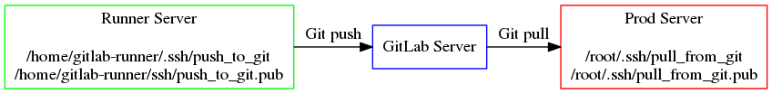

## Setting up your CI/CD infrastructure
### Set up trust
#### Allow runners to push to Prod via Git

Diagram:



---

## Setting up your CI/CD infrastructure
### Set up trust
#### Allow runners to push to Prod via Git


Generate SSH key in 'gitlab-runner' account on GitLab runner host:

```bash
sudo su - gitlab-runner -c "ssh-keygen -N '' -f ~/.ssh/push_to_git"
```
---
## Setting up your CI/CD infrastructure
### Set up trust
#### Allow runners to push to Prod via Git

Add the public key as a Deploy Key (deploy keys allowed to access the
git project in order to automate deployment of code):

Go to your "www" project,

Go to "Settings" tab,

Go to "Repository" sub-tab,

Select "Expand" option for "Deploy Keys".

Add the public key "push_to_git.pub" and check the "Write access allowed" checkbox.

---
## Setting up your CI/CD infrastructure
### Set up trust
#### Allow runners to push to Prod via Git

Run the following as root@Prod to add GitLab Server's host key:

```bash

sudo su - root -c "ssh-keyscan -H <Insert_GitLab_Server_hostname_here> >> ~/.ssh/known_hosts"
```
---
## Setting up your CI/CD infrastructure
### Set up trust
#### Allow runners to push to Prod via Git

As root on Prod web server, generate a key called "pull_from_git".

```bash
sudo su - root -c "ssh-keygen -N '' -f ~root/.ssh/pull_from_git"
```

---
## Setting up your CI/CD infrastructure
### Set up trust
#### Allow runners to push to Prod via Git

Add it as a "Deploy Key" and leave the "Write access allowed"
checkbox unchecked.

---
## Setting up your CI/CD infrastructure
### Set up trust
#### Allow runners to push to Prod via Git
Test your access (and here is when you would type "yes" to accept
the key if you were doing this on separate servers for Stage and Prod):

```bash
GIT_SSH_COMMAND="ssh -i ~/.ssh/pull_from_git" git clone git@INSERT_YOUR_GITLAB_SERVER_HOSTNAME_HERE:root/www.git /tmp/www
```
Later, we'll use this trust relationship to download code from Git
so that we can put it in the Web server document root.

P.S. GIT_SSH_COMMAND requires Git v2.3.0 or newer. You can also specify the SSH key via `.ssh/config`.
