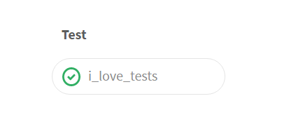

## Configuring CI/CD pipelines
### Continuous Integration
#### Minimum viable GitLab CI config

Minimum job definition:
- job name
- external command to run

Example:

```yaml
i_love_tests:

  script: /bin/echo run tests 
```
---
## Configuring CI/CD pipelines
### Continuous Integration
#### Minimum viable GitLab CI config
GitLab UI renders a pipeline showing:
- the stage that the job belongs to (default stage is "test")
- job name
- outcome


