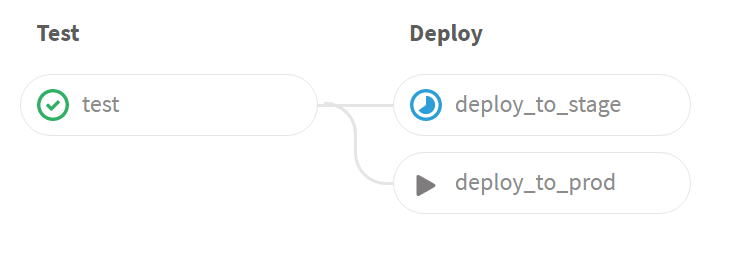
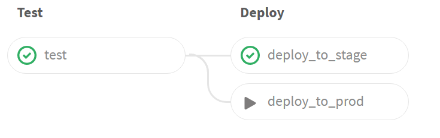
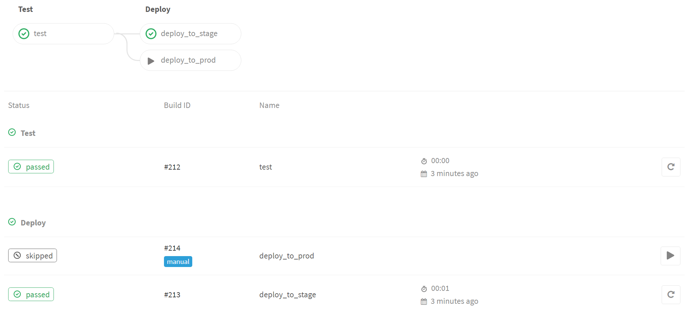

## Configuring CI/CD pipelines
### Continuous Delivery
#### Deploy via Git

Below you can see the tests have passed, deploy to Stage is in progress,
and deploy to Prod is set to manual (you have to click the Play triangle
to start it):

---
## Configuring CI/CD pipelines
### Continuous Delivery
#### Deploy via Git

After the deploy to Stage completes, we see:

---
## Configuring CI/CD pipelines
### Continuous Delivery
#### Deploy via Git

If you look at the pipeline detail, you can see the deploy to 
Prod was skipped, and is tagged as a "manual" deploy:

