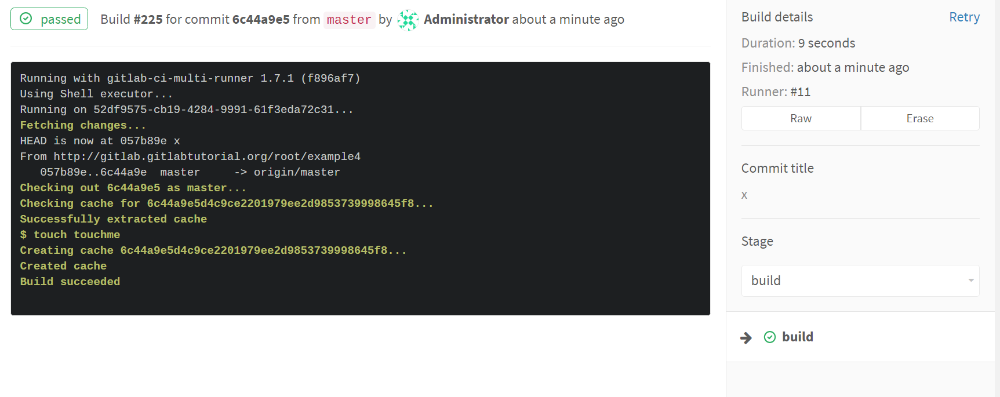
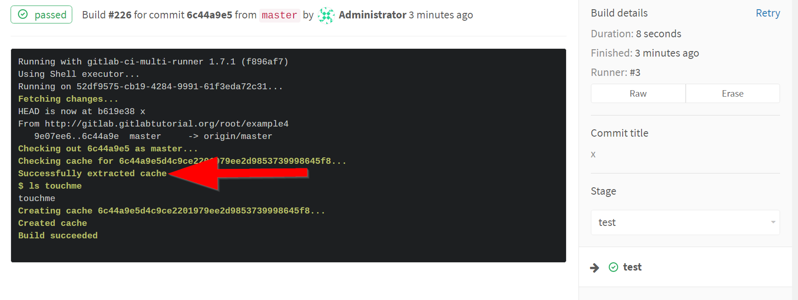

"cache" allows you to define list of files that should be
cached (on GitLab Runner) between runs.

Here is an example of caching files between stages:

```yaml
cache:
  untracked: true        # cache all files not tracked by Git
  key: "$CI_BUILD_REF"   # define the affinity of caching to per-commit
                         # RHS is effectively name of your cache.

build:
  stage: build
  script: touch touchme

test:
  stage: test
  script: ls touchme
```

The "build" job creates the cache:




The "test" job loads the cache:

