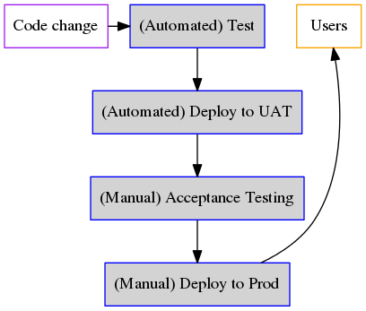

# GitLab CI/CD Tutorial

Aleksey Tsalolikhin

aleksey@verticalsysadmin.com

28 October 2017

---

## Table of contents

- Introduction
- Setting up your CI/CD infrastructure
- GitLab CI/CD basics
- Would you like to know more?

---

## Introduction

### GitLab

[GitLab](https://about.gitlab.com) is a Web application for working together on code. In addition to a Git data store, it has everything you need for a modern workflow: ticketing system, issue boards, code review, CI/CD, chat and more -- all smoothly integrated in one UI.

GitLab.com is the public service; the software is also available for private (on-prem) use in the Community Edition (open source, free of charge) and the Enterprise Edition (commercial -- ask me for a discount code).

---
## Introduction

### GitLab CI/CD (Runner Server)

GitLab comes with an add-on package called Runner Server which provides runners. Simply put, a runner is what runs the tests. Runners can run build jobs, test jobs, and deploy jobs. Or actually any kind of job! Runner Server works with GitLab through GitLab Server's API.

---?include=01_05-architecture.md

---

## Introduction

### Lab exercise

In this tutorial, you will set up:

- GitLab Server 
- Runner Server
- UAT environment
- Production environment

Using these building blocks, you will set up a **CI/CD pipeline**:

You will then re-use the UAT and Production environments in the Jenkins tutorial.

---

## Introduction

### Lab exercise

The pipeline could be fully automated:

---?include=01_10-installing-gitlab-server.md

---?include=01_12-setting-up-a-project.md

---?include=01_13-enabling-ci-on-a-project.md

---?include=01_15-installing-docker.md

---?include=01_20-installing-gitlab-ci.md

---

<!-- setting up runners -->

---?include=01_22-registering-our-first-runner.md

---?include=01_25-register-and-enable-Docker-runner.md

---?include=01_26-test-docker-runner.md

---?include=01_27-change-docker-image.md

<!-- setting up UAT and Prod environments -->
---?include=01_91-set-up-prod-and-stg-web-sites.md
---?include=01_92-deploy-using-ssh.md
---?include=01_93-deploy-via-git.md

---
## CI/CD pipeline basics
"Configuring CI/CD pipelines" section will go here

<!--
- [GitLab CI/CD basics](02-ci-basics/README.md)
-->

---?include=bookmarks.md
