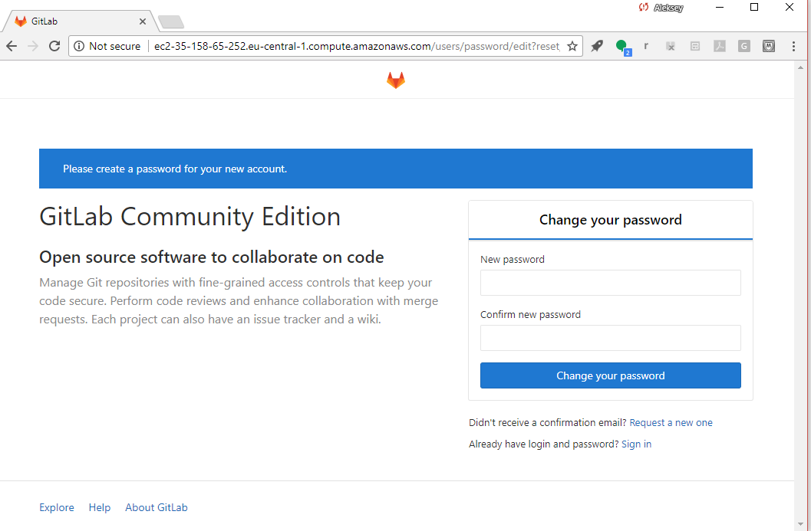

# Installing GitLab CE

## Community Edition (CE), Enterprise Edition (EE)

GitLab CE is the Community Edition (open source) of GitLab.

There is also GitLab EE (Enterprise Edition) which comes with additional
features and commercial support. (I am a GitLab EE reseller, and offer
a discount to my students.)

## Creating a host

Note: GitLab recommends installing Runner Server on dedicated hosts.

In this tutorial, we put GitLab Server and Runner Server on the the same host
for convenience.

Provision the host on a public cloud (e.g., Joyent or AWS) or on your VM if 
you were provided one. Here are the Joyent parameters I use:

- Data center: us-west-1 (closest to me)
- Hardware Virtual Machine (to run Docker inside the VM)
- Ubuntu 16 LTS (ubuntu-certified-16.04) (latest Ubuntu LTS)
- High CPU with 8 GB of RAM

## Installing the Omnibus package

We'll use the official Omnibus GitLab package (as the GitLab documentation recommends).

Follow the download and installation instructions on https://about.gitlab.com/installation/#ubuntu

Select "local" when prompted for mail server configuration options. (We are not going to use mail.)

After the installation is done, GitLab will tell you its URL.

IMPORTANT -- Note this URL -- you will need it later!

Note the URL of your GitLab instance, you *will* need it later.

Go to this URL and set the password for `root` (your admin user and right now the only user on the system).

# [[Up]](README.md)
