# Add a project

- [Add a practice project](#add-a-practice-project)
- [Add a README.md to your project](#add-a-readme-md-to-your-project)
- [Get rid of the "add an SSH key" prompt](#get-rid-of-the--add-an-ssh-key--prompt)

## Add a practice project

Add a project. You will use this project to explore GitLab CI functionality.

Select the "New..." icon (it looks like a plus sign) and select "New project".

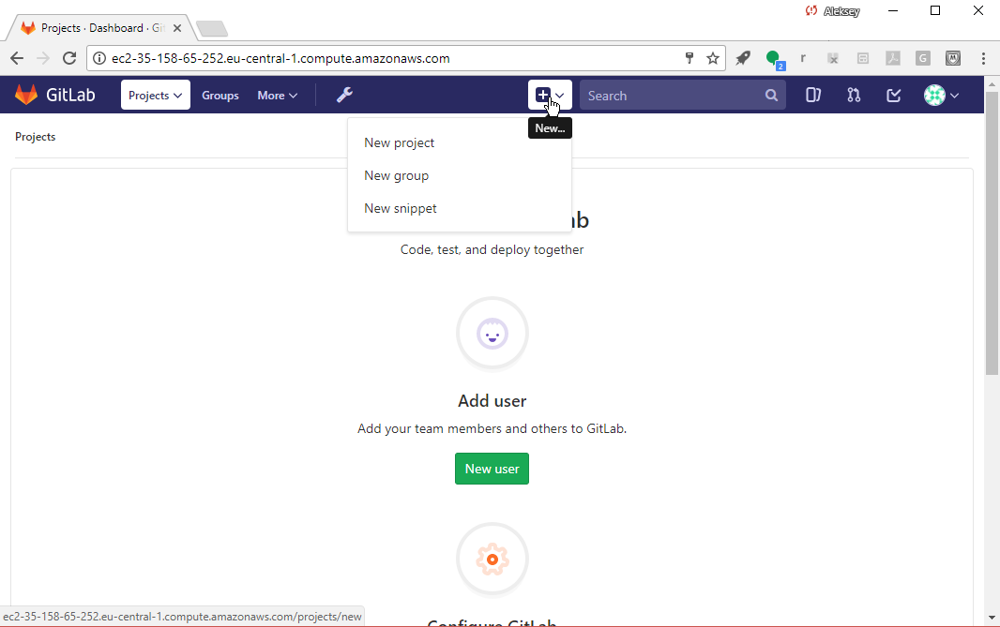

Name the project. Call it "www" (we'll pretend it contains the source code
for our web site).

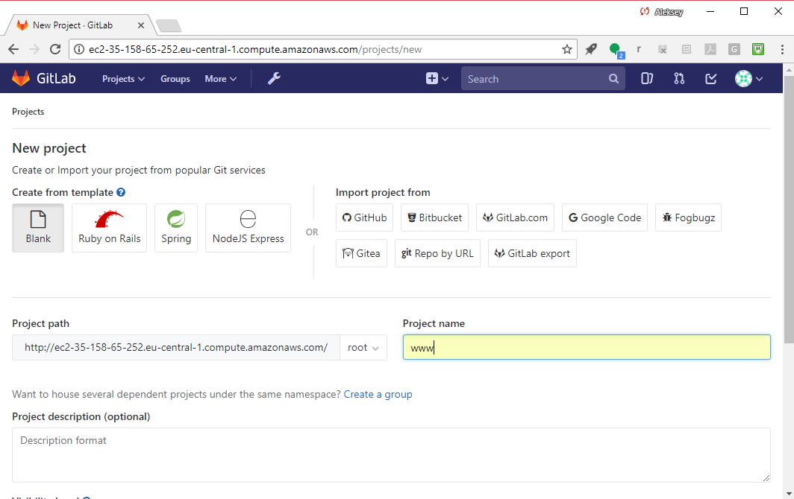

Select the big fat green "Create project" button to create your project.

## Get rid of the "add an SSH key" prompt

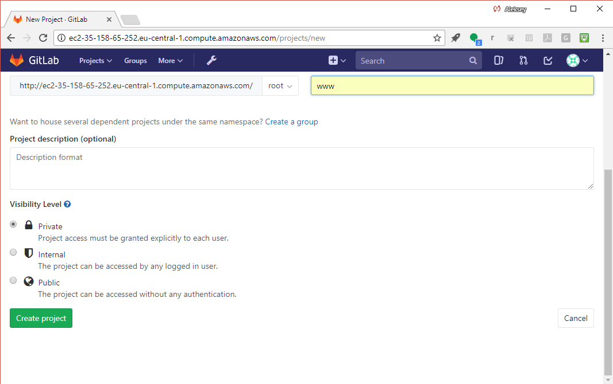

GitLab will now take you to the "www" project page, and you should see
a prompt to add an SSH key to your profile so you can pull or push
project code.

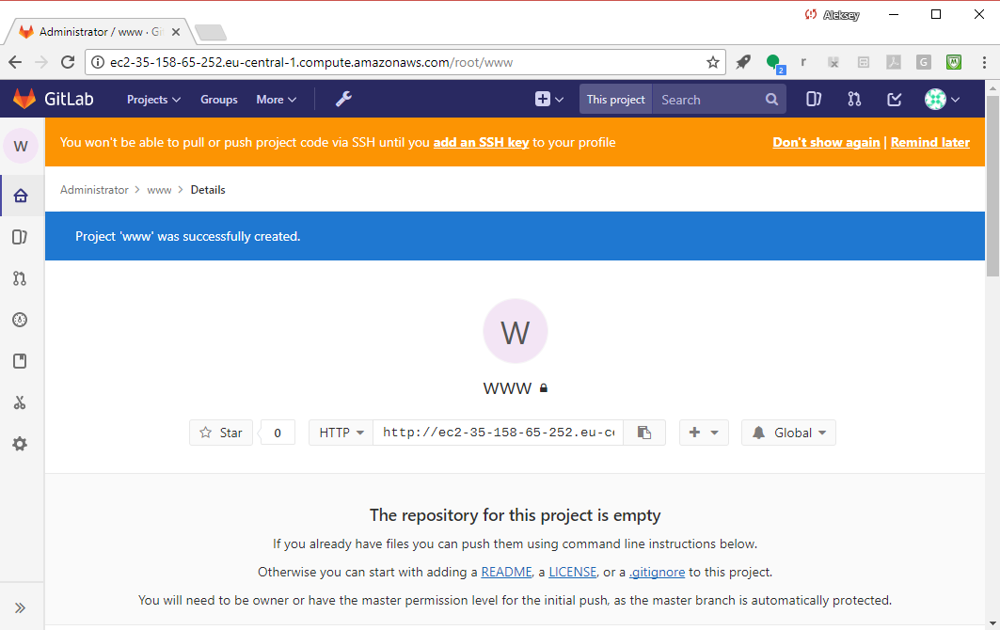

Select "Don't show again" in the SSH warning, as in this tutorial,
you'll use the GitLab Web UI to change files in your project.

<!--
## Add an SSH key

Select "add an SSH key", and then, in your shell session,
create an SSH key:

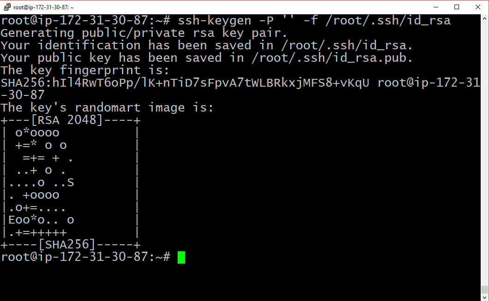

Whoomp! There it is:

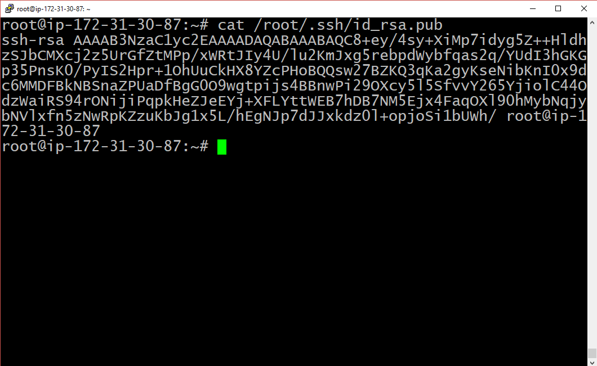

Add your public key to GitLab:

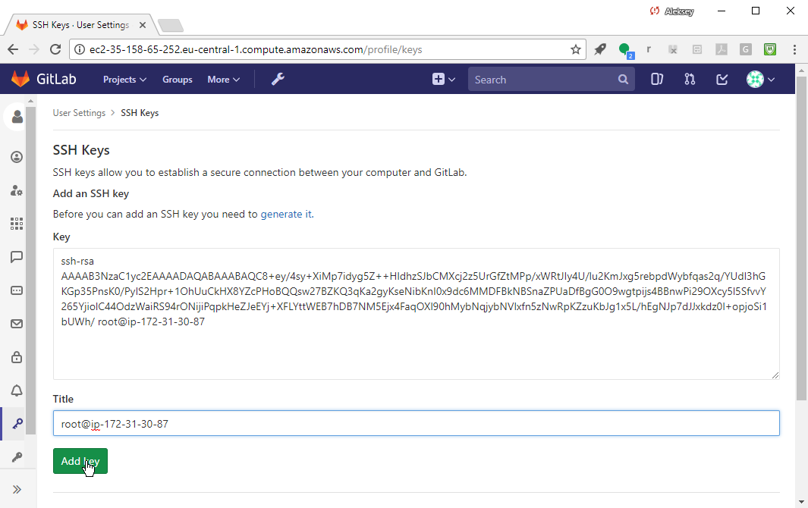

Go back to your "www" project:

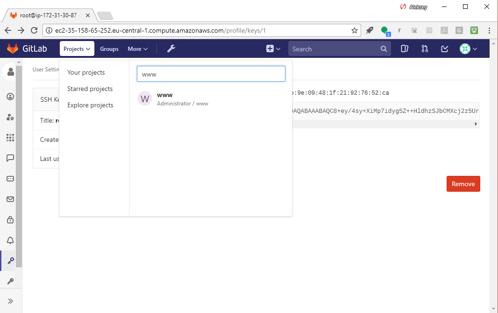

-->

## Add a README.md to your project

Add a README.md file by selecting "README" in the UI:

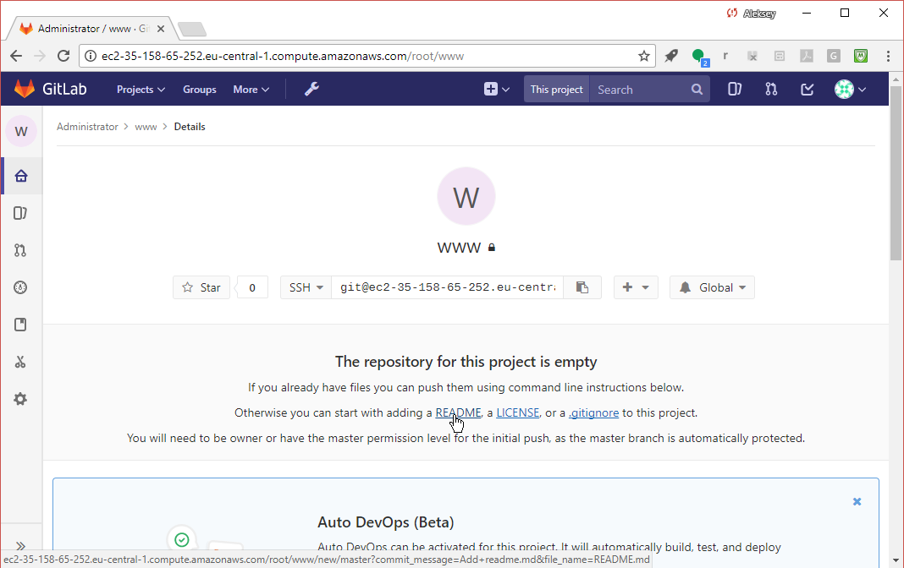

Put in some text (e.g., "I am a README file") and select "Commit changes"
to create the file.

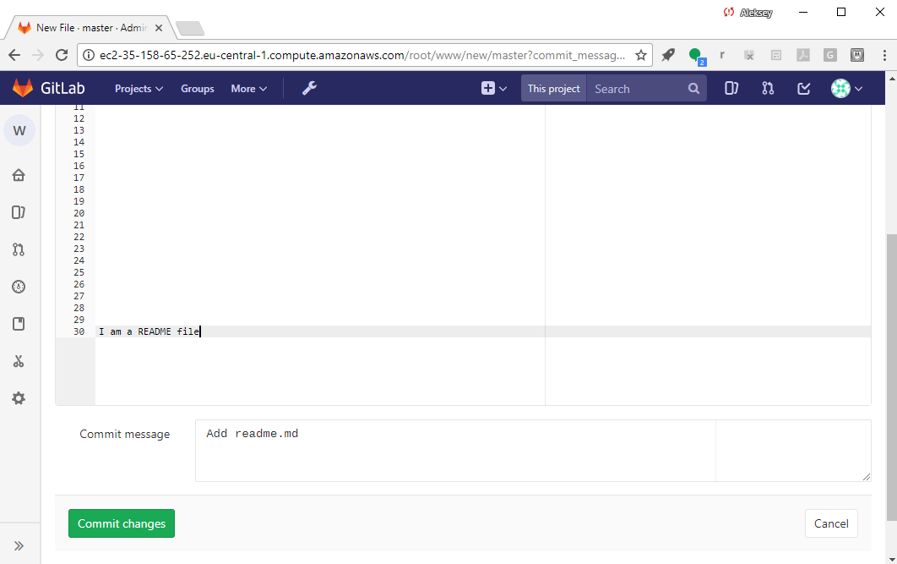

You should then see the confirmation.

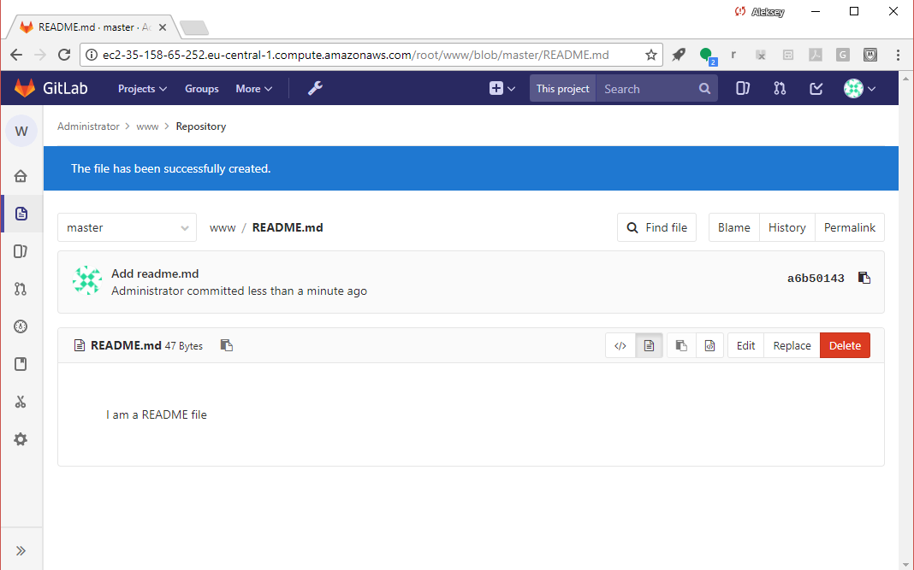

Use the breadcrumbs at the top to go back to the main "www" project screen:

And you should now see the "Set up CI" button:

# [[Next]](13-enabling-ci-on-a-project.md) [[Up]](README.md)
