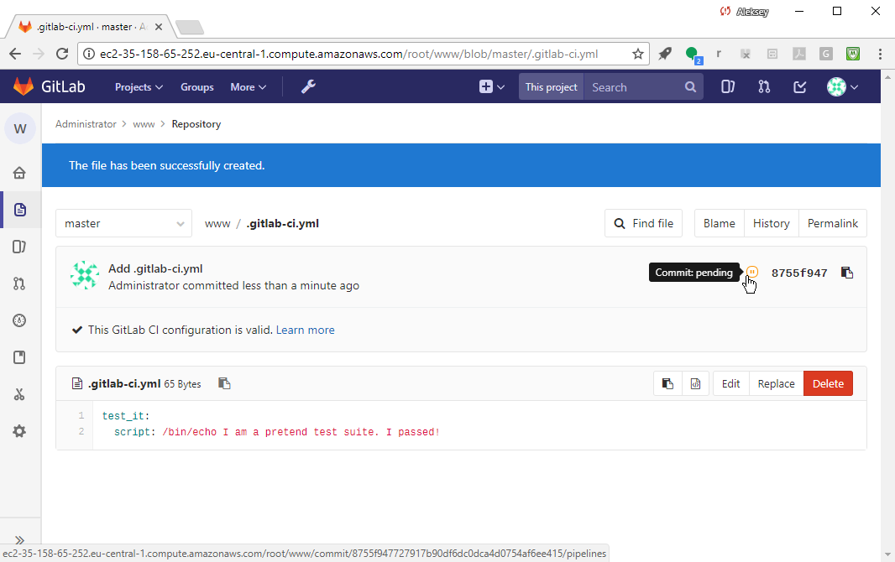

# Add a project and set up CI for it

## Add a project

Add a new project. You will use this project to explore GitLab CI functionality.

Select the "New..." icon (it looks like a plus sign) and select "New project".


Name the project. Call it "www" (we'll pretend it contains the source code
for our web site).


Select "Create project" (below, green).


GitLab will now take you to the "www" project page, and you should see
a prompt to add an SSH key to your profile so you can pull or push
project code.


Go ahead and select "add an SSH key", and then, in your shell session,
create an SSH key:


Whoomp! There it is:


Add it to GitLab:


Go back to your "www" project:


Add a README.md file by selecting "README" in the UI:


Put in some text (e.g., "I am a README file") and select "Commit changes"
to create the file.


You should then see the confirmation.


Use the breadcrumbs at the top to go back to the main "www" project screen:


And you should now see the "Set up CI" button:


## Set up CI


Select "Set up CI" to add the CI config file, `.gitlab-ci.yml`.

The config file format is described in detail in  
[Configuration of your builds with .gitlab-ci.yml - GitLab Documentation](https://docs.gitlab.com/ce/ci/yaml/README.html)

Let's start with a stub test job:


```
test_it:
  script: /bin/echo I am a pretend test suite. I passed!
```


Select "Commit changes" at the bottom, green.

Our first CI test job, "test_it" will run on every single commit 
to test the new revision. It will execute the /bin/echo command.

Notice that GitLab automatically checks the syntax of the CI config file
and will alert you if the config does not pass validation.

You may notice the "pending" indicator - that's because we haven't
set up a Runner Server yet to run the job:




Go to "CI/CD -> Pipelines" to see our pipeline status:


Here is the status:


The pipeline is stuck in Pending, because we haven't setup any Runners yet. 
We'll do that next.

### Definition: Runner
A GitLab "runner" is an abstraction. It's a way for GitLab to tell the
Go `gitlab-ci-multi-runner` process on GitLab Runner server what type
of environment to create (e.g. shell, Docker, Vagrant VM, Parallels
VM, etc.) and to communicate the (secret) variables needed to connect
to different APIs, etc.  It also provides a way to control access
at the project level (a runner can be dedicated to a project) or
using tags (runners can be tagged during registration) and you can
then say I want THIS build job to run only on runners with tag X.
