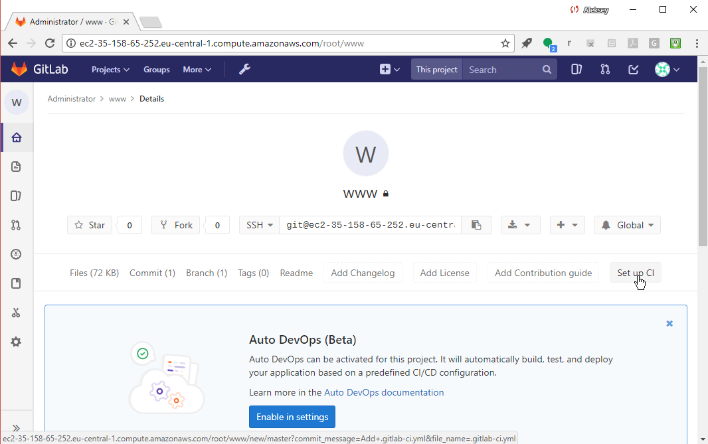
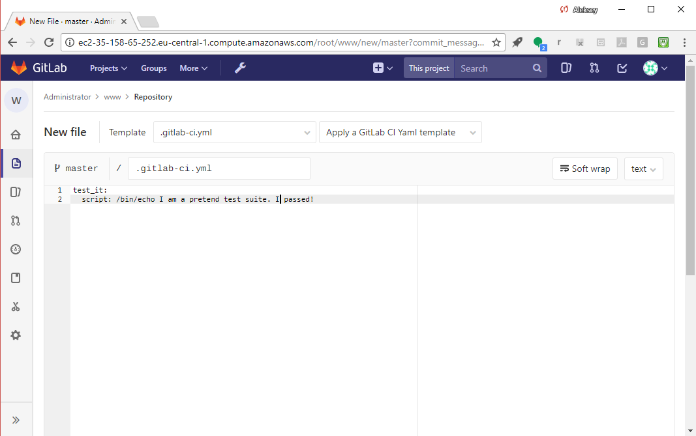
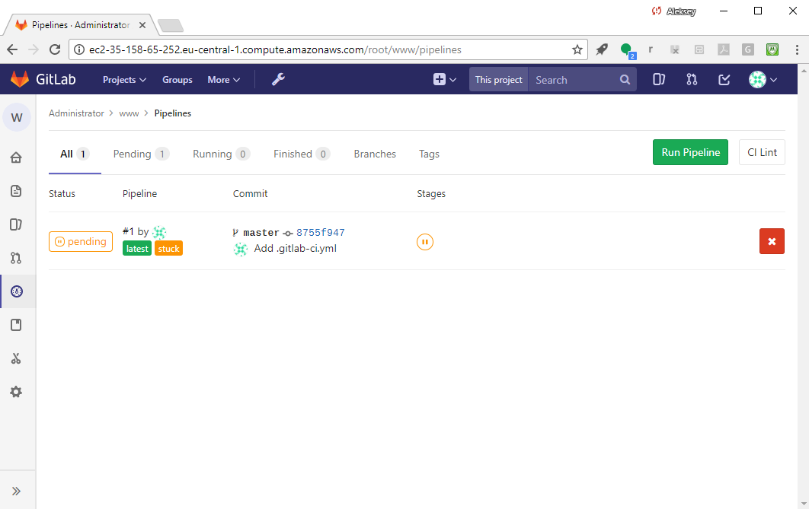

# Set up CI

Notice the "Set up CI" button:



Select "Set up CI" to add the CI config file, `.gitlab-ci.yml`.

The config file format is detailed in  
[Configuration of your builds with .gitlab-ci.yml - GitLab Documentation](https://docs.gitlab.com/ce/ci/yaml/README.html)

Make a note of this link -- this _the_ reference for GitLab CI syntax!

Let's start with a stub test job:


```
test_it:
  script: /bin/echo I am a pretend test suite. I passed!
```


Select "Commit changes" at the bottom, green.

Our first CI test job, "test_it" will run on every single commit 
to test the new revision. It will execute the /bin/echo command.

Notice that GitLab automatically checks the syntax of the CI config file
and will alert you if the config does not pass validation.

You may notice the "pending" indicator - that's because we haven't
set up a Runner Server yet to run the job:


Go to "CI/CD -> Pipelines" to see our pipeline status:


Here is the status:



The pipeline is stuck in Pending, because we haven't setup any Runners yet. 
We'll do that next.

### Definition: Runner
A GitLab "runner" is an abstraction. It's a way for GitLab to tell the
Go `gitlab-ci-multi-runner` process on GitLab Runner server what type
of environment to create (e.g. shell, Docker, Vagrant VM, Parallels
VM, etc.) and to communicate the (secret) variables needed to connect
to different APIs, etc.  It also provides a way to control access
at the project level (a runner can be dedicated to a project) or
using tags (runners can be tagged during registration) and you can
then say I want THIS build job to run only on runners with tag X.

# [[Next]](15-installing-docker.md) [[Up]](README.md)
