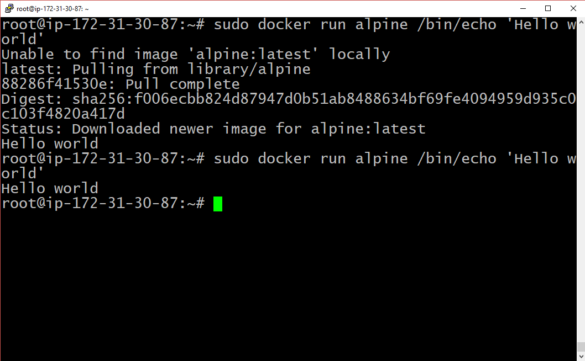

## Install Docker

Let's install Docker, so our Runners can run repeatable tests in reproducible environments.

Do this on the Runner Server, which, in our case, is the same as the GitLab Server.

```shell_session
# Install Docker
curl -sSL https://get.docker.com/ | sudo sh


# confirm Docker works
sudo docker run alpine /bin/echo 'Hello world'
```



# [[Next]](20-installing-gitlab-ci.md) [[Up]](README.md)
