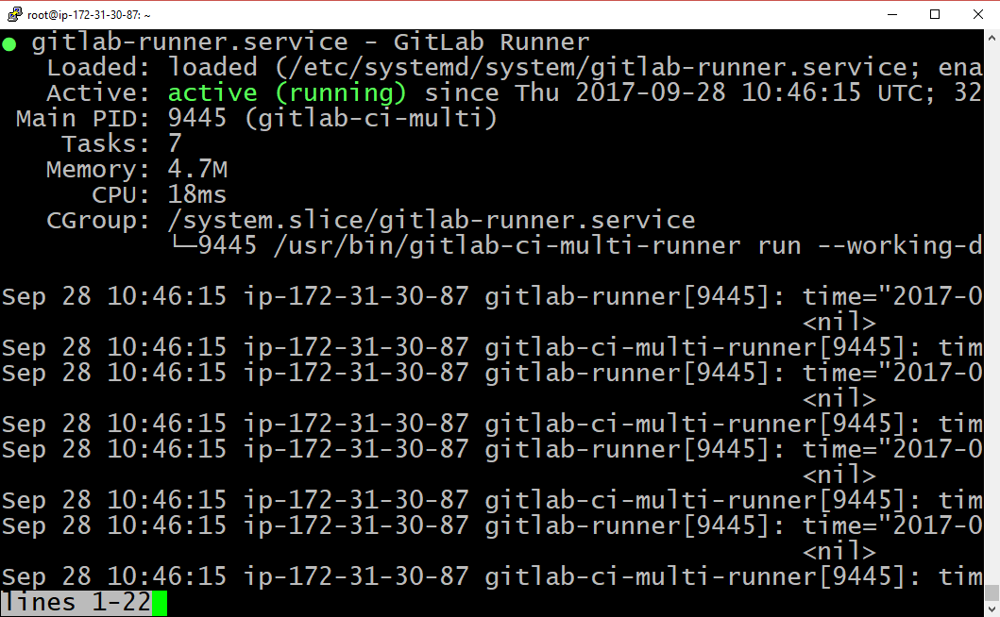

# Install Runner Server


The Runner Server is in the GitLab `gitlab-ci-multi-runner` repository.

Add the repo definition, install Runner Server, and allow the Runner Server to use Docker:


```console
# Add the repo definition
curl -L https://packages.gitlab.com/install/repositories/runner/gitlab-ci-multi-runner/script.deb.sh | sudo bash

# Install Runner Server
sudo apt-get install -y gitlab-ci-multi-runner
```

## Confirm Runner Server is active

The "Active" status should be "active (running") when you check service status:


```console
sudo service gitlab-runner status
```




## Allow Runner Server to use Docker

Add "gitlab-runner" user to the docker group to allow
the non-root user "gitlab-runner" to use Docker fully.

```console 
sudo usermod -aG docker gitlab-runner

```
## gitlab-runner config file

Runner Server has its own config file, in `/etc/gitlab-runner/config.toml`

Let's take a look at it.


```console
sudo cat /etc/gitlab-runner/config.toml
```

Example:

```shell_session
ubuntu@ip-172-31-24-94:~$ sudo cat /etc/gitlab-runner/config.toml
concurrent = 1
check_interval = 0
ubuntu@ip-172-31-24-94:~$
```

Note: TOML is [Tom's Obvious, Minimal Language](https://github.com/toml-lang/toml). 
Just as YAML is simpler (and more readable) than XML, so is TOML is simpler 
(and more readable) than YAML.

| Setting | Description |
|---------|-------------|
| concurrent | Limits how many jobs globally can be run concurrently. The most upper limit of jobs using all defined runners. 0 does not mean unlimited |
| check_interval | defines in seconds how often to check GitLab for a new builds |

We won't look at the [other settings](https://gitlab.com/gitlab-org/gitlab-ci-multi-runner/blob/master/docs/configuration/advanced-configuration.md) now.

# [[Next]](21-install-build-and-test-tools.md) [[Up]](README.md)
