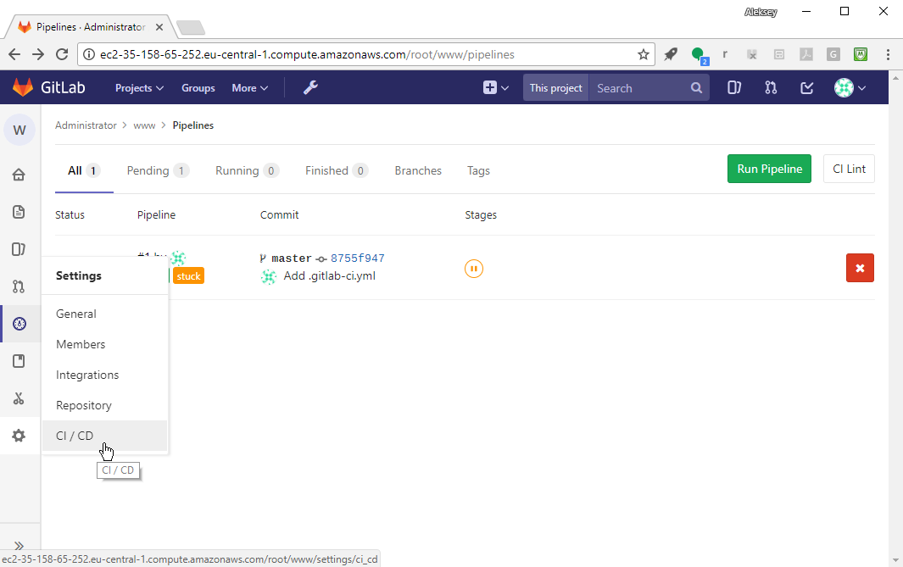
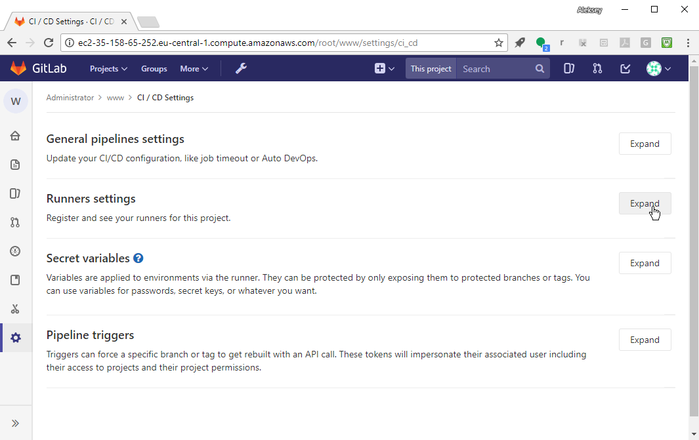
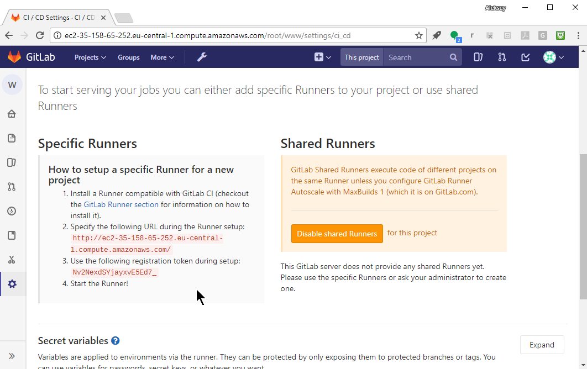
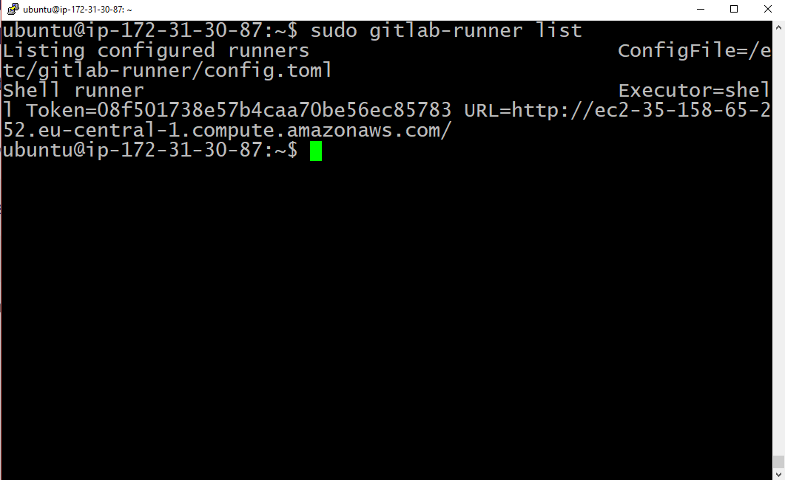
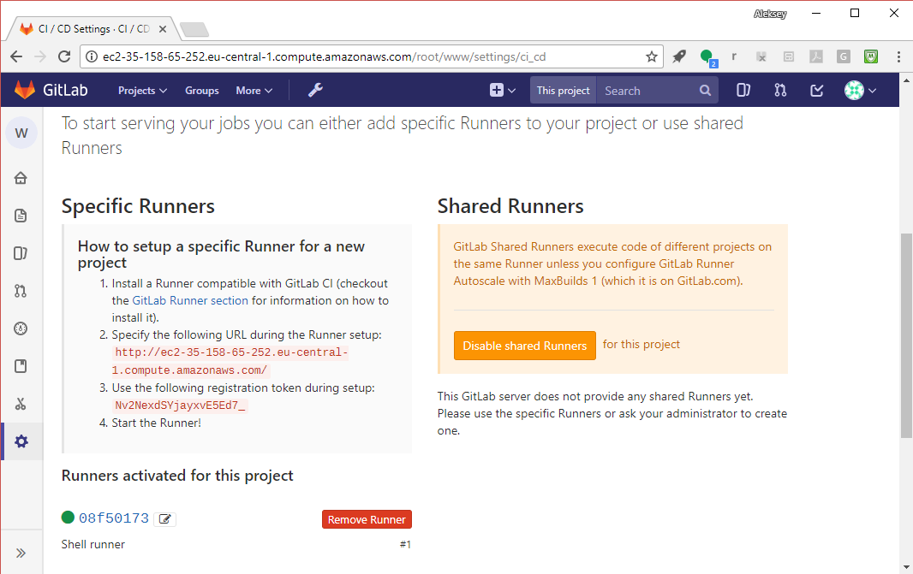
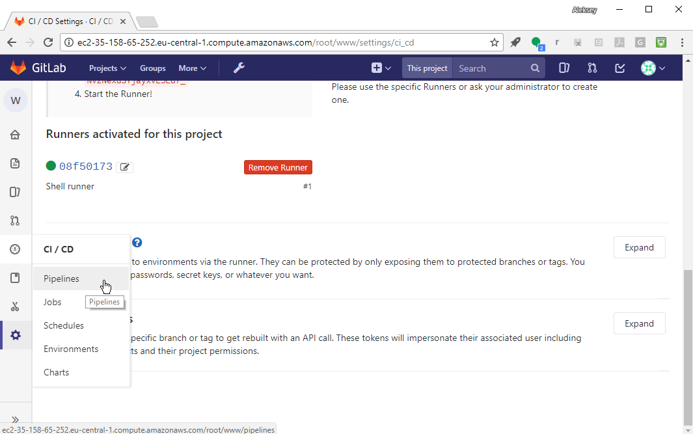
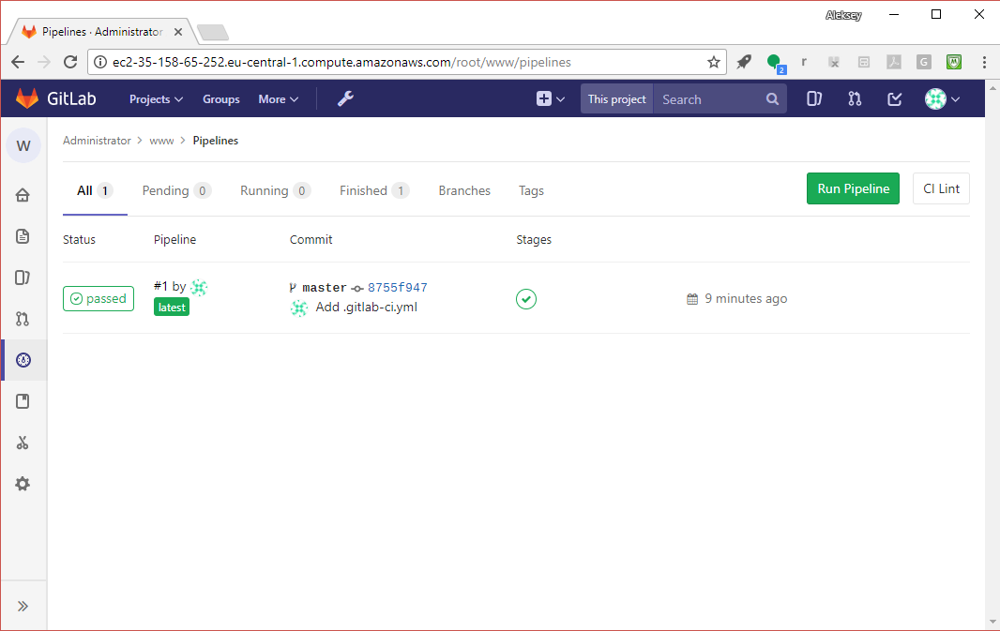
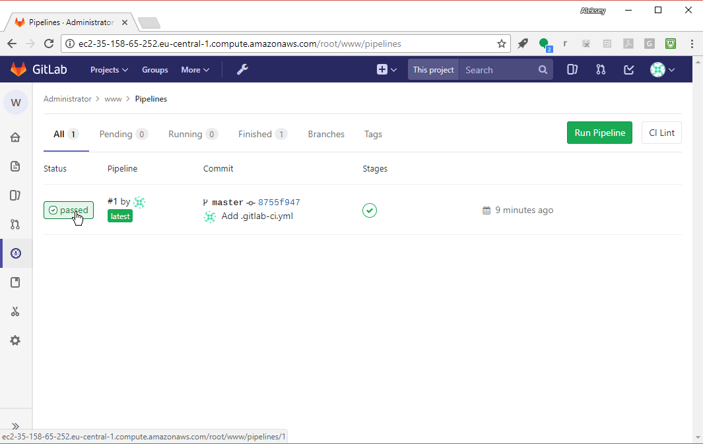
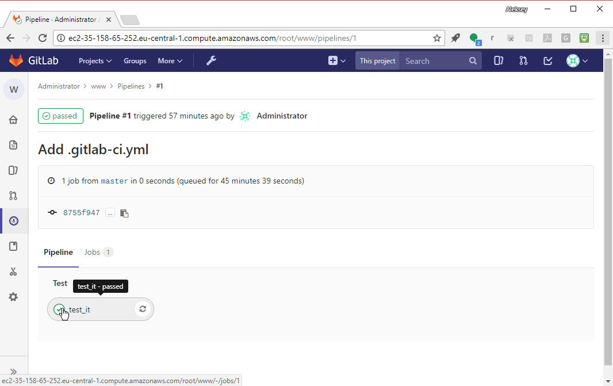
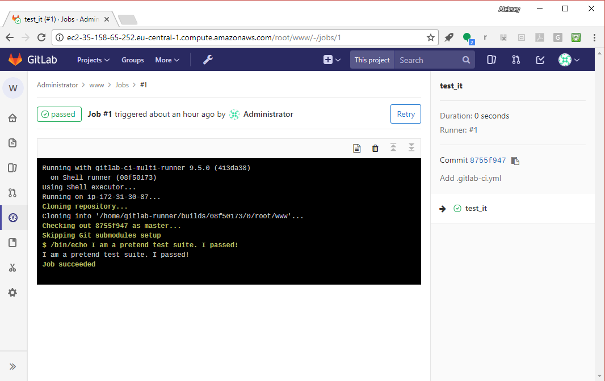

# Register a Shell runner

In this section, we will learn how to register runners

## CI/CD settings

Go to "Settings" -> "CI/CD"


Find "Runner settings" in the menu:


You'll find there are no runners listed yet (we haven't set any up yet), 
and you'll find instructions (in the left pane) for registering runners
with GitLab:



## Register a Shell runner

When you register a runner, you have to specify:
- The GitLab Server API endpoint (to pick up jobs, return outcomes and upload build artifacts).
- A registration token.
- An "executor". This tells the Runner Server in what kind of environment to execute the job (e.g., Shell, SSH, Vagrant, Docker, Kubernetes).

Register a runner:

```bash
sudo gitlab-ci-multi-runner register
```

Go to the "Settings" tab of your project, and then select the "Pipelines" sub-tab.

You'll see the URL you will need to provide GitLab Runner (tells it how to get to GitLab) as well as the registration token.

- Provide the URL from the "CI/CD settings" page
- Provide the token from the "CI/CD setting" page
- For description, you can put "Shell runner".
- Don't put any tags (we'll learn later how to tag jobs to route them to specific runners).
- Don't lock the runner to a project (not locking the runner makes it a shared runner, it can be shared between projects)
- For executor, pick "shell".


You can also register runners non-interactively:

```bash
sudo gitlab-runner register --non-interactive \
                            --url <url> \
                            --registration-token <token> \
                            --executor shell \
                            --description "Shell Runner"
```

You should now see the Shell runner:

```bash
sudo gitlab-runner list
```



Refresh the "CI/CD settings" page and expand Runner settings and you'll see your Shell runner:





Notice that it has a green "ready" light: it's online and checking in for jobs:


Notice also you can select the runner id (next to the green light) to see
runner detail; and that you can select the "edit" icon (next to the id)
to change the runner's configuration. (Don't change anything yet.)

Notice also we now have a "Remove Runner" button.

Now select "CI/CD" -> "Pipelines" in the menu:



Remember the job that was pending because no runner was available?
It should now say "Passed":



Select the "Passed" icon:



This will expose the detail of the pipeline:


Notice this pipeline only has one stage (Test) -- that's the default stage;
and one job in that stage, "test_it", which passed.

Select the job icon:


Now you will see the job detail, including the console log:



Notice that the runner checked out the code from Git and then tested it.
# [[Next]](24-unregistering-runners.md) [[Up]](README.md)
