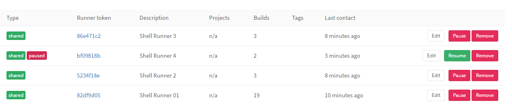

# Paused Runner

A paused runner is not going to pick up any jobs.

Example of a paused runner:

Go to your runners admin page and then pause your runner. Now resume it.

# [[Next]](86-shell-again.md) [[Up]](README.md)
