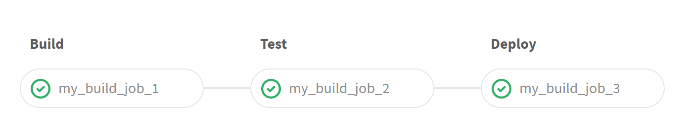

# Simple 3 stage pipeline



Try running this pipeline.


```yaml
stages:
  - build
  - test
  - deploy

build_it:
  stage: build
  script:
  - /bin/echo This is a mock build job
  - touch /tmp/build
  - ls -lh /tmp/build


test_it:
  stage: test
  script:
  - /bin/echo This is a mock test job
  - ls -lh /tmp/build


deploy_it:
  stage: deploy
  script:
  - /bin/echo This is a mock deploy job
  - ls -lh /tmp/build
```

[yaml](yaml/simple-3-stage-pipeline.yaml)

# [[Up]](README.md)
