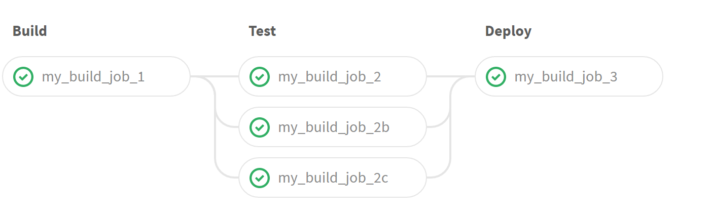

# 3 stage pipeline with parallel jobs



Try running this pipeline:

```yaml
my_build_job_1:
  stage: build
  script: 
  - /bin/echo This is a mock build job


my_build_job_2:
  stage: test
  script: 
  - /bin/echo This is a mock test job
  
my_build_job_2b:
  stage: test
  script: 
  - /bin/echo This is a mock test job


my_build_job_2c:
  stage: test
  script: 
  - /bin/echo This is a mock test job
  
my_build_job_3:
  stage: deploy
  script: 
  - /bin/echo This is a mock deploy job
  - ls -lh /tmp/build /tmp/test
```

[yaml](yaml/3-stage-pipeline-with-parallel-jobs.yaml)

# [[Up]](README.md)
