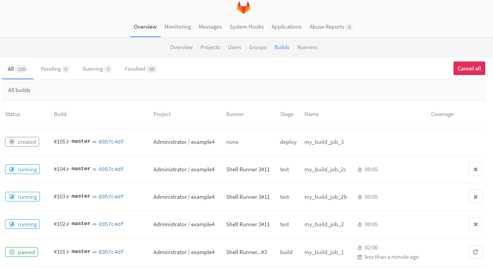

# Build Concurrency

The default build concurrency is 1.

Increase it in /etc/gitlab-runner/config.toml

Do you need to reload the `gitlab-ci-multi-runner` service?

Do your multiple test jobs run in parallel now?

