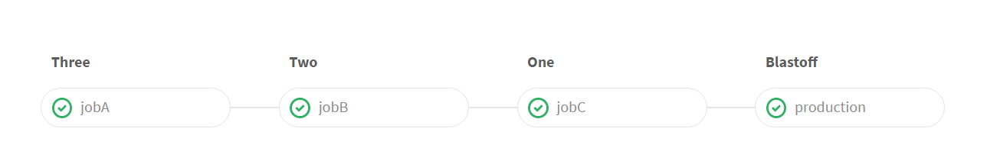

# Custom Stages

You don't have to use the stage sequence *build*, *test*, *deploy*.

You can make your own, [like GitLab does](https://gitlab.com/gitlab-org/gitlab-ce/blob/master/.gitlab-ci.yml)

# [[Up]](README.md)
