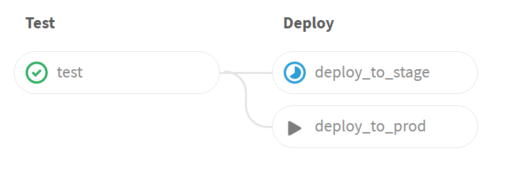
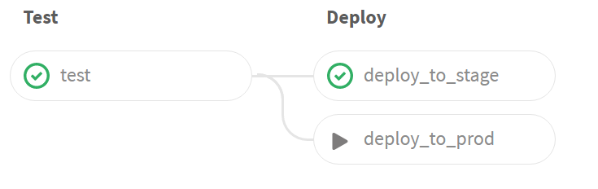
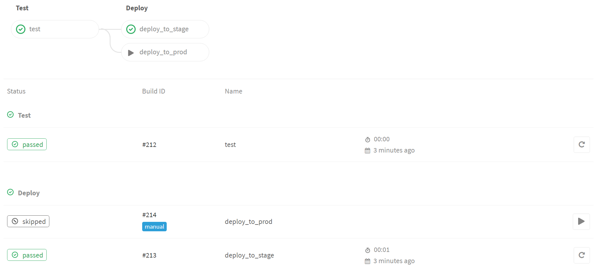

# Test, Auto Deploy to STG, Manual Deploy to Production

AKA Continuous Delivery

## YAML

The following will test with phpunit and if the test succeeds, will push
the code to the stage branch in Git, from where it will get slurped up
by the STAGE website where it's available for human gatekeeper review
and manual push to production:

```yaml

test:
  script: cd www/html && phpunit UnitTest HelloTest.php

deploy_to_stage:
  stage: deploy
  script:
  - GIT_SSH_COMMAND="ssh -i ~gitlab-runner/.ssh/push_to_git" git push --force git@alpha.gitlabtutorial.org:root/www.git +HEAD:refs/heads/stage
  environment: stage

deploy_to_prod:
  stage: deploy
  script:
  - GIT_SSH_COMMAND="ssh -i ~gitlab-runner/.ssh/push_to_git" git push --force git@alpha.gitlabtutorial.org:root/www.git +HEAD:refs/heads/prod
  environment: production
  when: manual
```
## Deploy to STAGE in progress

Here you can see the tests have passed, deploy to stage is in progress,
and that deploy to production is set to manual (you have to click the
Play triangle to start it):




## Deploy to STAGE complete

After the deploy to stage completes, we see:



## Pipeline detail

If you look at the pipeline detail, you can see the deploy to 
prod was skipped, and is tagged as a "manual" deploy:



## Notes on setup

My gitlab-runner account's SSH key is allowed to write to the GitLab repo
repo.

My mock stage and production website instances are tracking the "stage" and "production" branches
with a cron job (replace `alpha.gitlabtutorial.org` with the URL of your "www" repository):
```
* * * * * GIT_SSH_COMMAND="ssh -i ~/.ssh/pull_from_git" git archive --remote=git@alpha.gitlabtutorial.org:root/www.git prod www/html/ 2>/dev/null| tar -x --transform s:www/html:/var/www/prod-html: -C / 2>/dev/null
* * * * * GIT_SSH_COMMAND="ssh -i ~/.ssh/pull_from_git" git archive --remote=git@alpha.gitlabtutorial.org:root/www.git stage www/html/ 2>/dev/null| tar -x --transform s:www/html:/var/www/stg-html: -C / 2>/dev/null

```

In the source repo, the Web files are in "www/html"; I am using GNU Tar's --transform
to put them in /var/www/prod-html and /var/www/stg-html.

For production use, you may want a tool like [Travis-CI dpl](https://docs.gitlab.com/ce/ci/examples/deployment/README.html) which can deploy to a wide variety of [service providers](https://github.com/travis-ci/dpl#supported-providers), but the above demonstrates a basic CI/CD pipeline.
